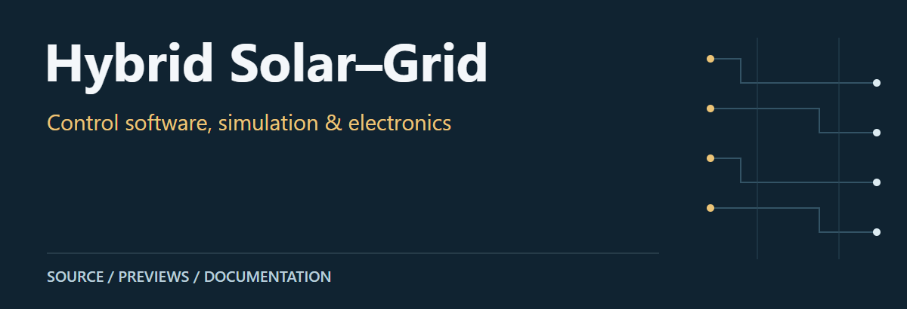
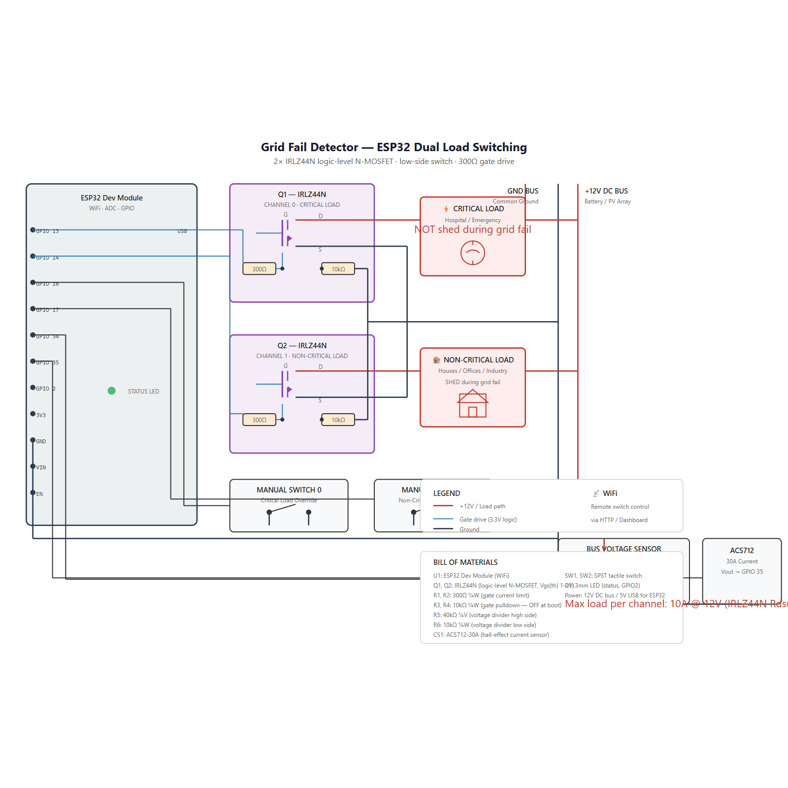
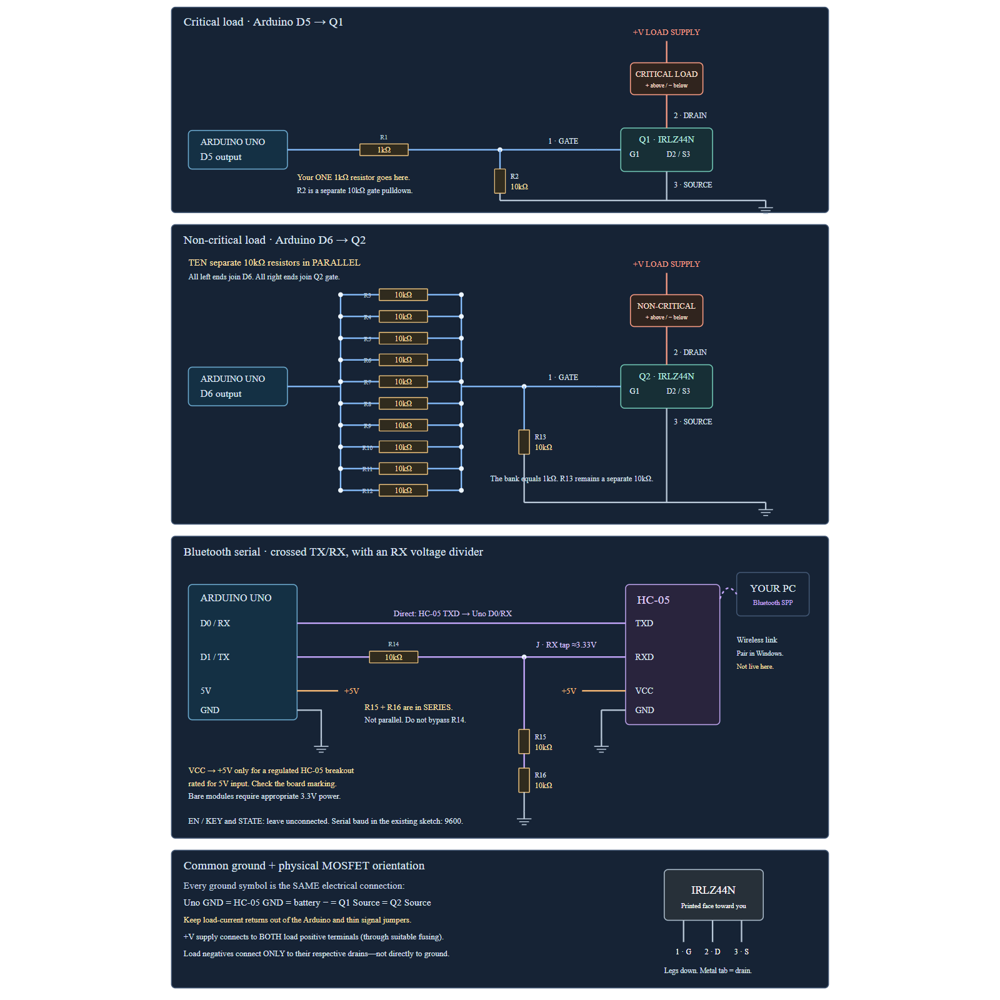
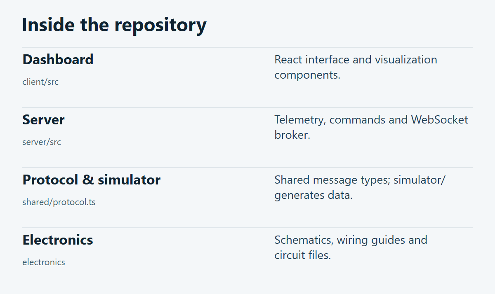

# Hybrid Solar–Grid

A solar-grid hybrid control project with a React/TypeScript dashboard, Node.js services, a telemetry simulator and electronics design files. The interface includes five-zone load control and a miniature-city view.

**[Source guide](#source-guide)** · **[Getting started](#getting-started)** · **[Scope & limitations](#scope--limitations)**

## Preview

[](docs/visuals/dual-load-switching-schematic.png)

Dual-load switching schematic rendered from the repository SVG. Open at full resolution for component labels.

[](docs/visuals/uno-hc05-visual.png)

UNO / HC-05 wiring drawing rendered from the repository SVG.

[Original schematic SVG](electronics/dual-load-switching-schematic.svg) · [UNO / HC-05 wiring preview](docs/visuals/uno-hc05-visual.png) · [User manual](USER_MANUAL.md)

## Source guide

[](docs/visuals/repository-guide.png)

| Component | Open source | Purpose |
| :-- | :-- | :-- |
| Dashboard | [`client/src`](client/src) | React interface and visualization components. |
| Server | [`server/src`](server/src) | Telemetry, commands and WebSocket broker. |
| Protocol & simulator | [`shared/protocol.ts`](shared/protocol.ts) | Shared message types; simulator/ generates data. |
| Electronics | [`electronics`](electronics) | Schematics, wiring guides and circuit files. |

## Getting started

From a local checkout of this repository:

```bash
npm ci
npm run dev
```

## Scope & limitations

The electronics images are design artifacts, not evidence of a powered physical build. The frontend builds, but the offline capture did not display its city geometry; no physical device or live telemetry was connected. No physical electrical validation was performed in this update.

## Contributors

Md Sadman Bin Masud · Mayesha Muntaha · Shihab Uddin · Rafith

---

[Visual asset sources and presentation notes](docs/visuals/README.md)
