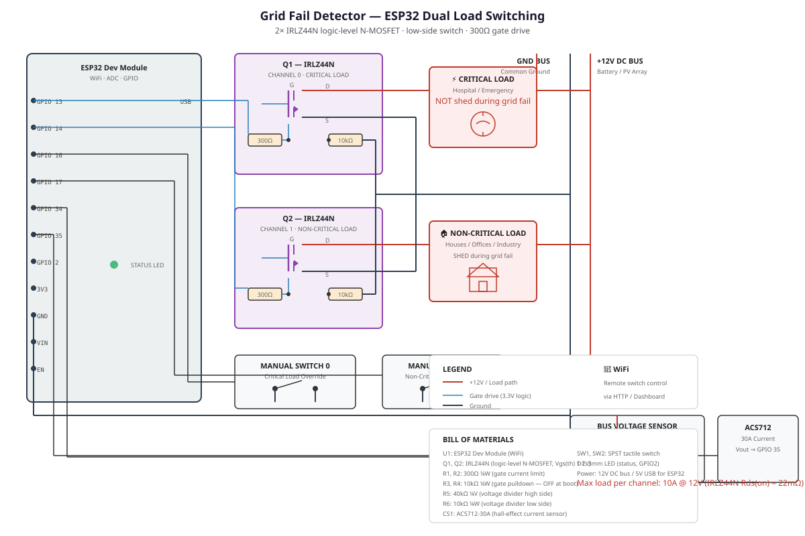
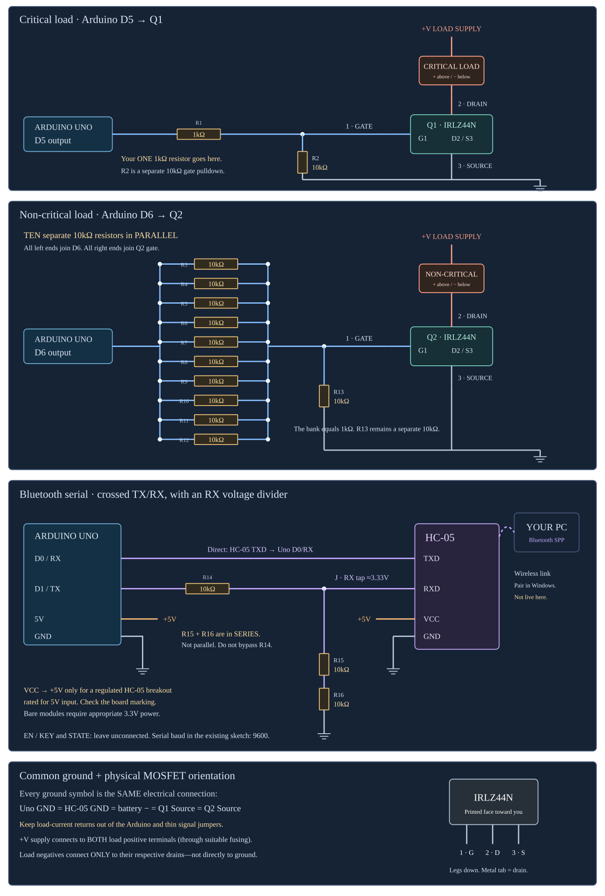
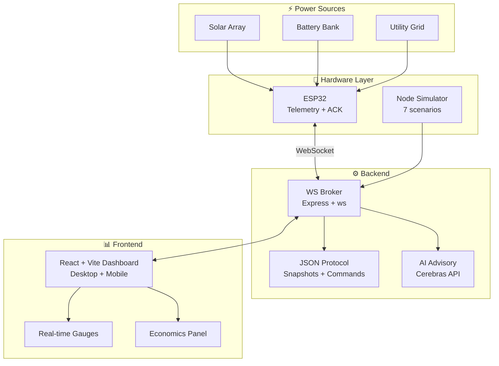

**Real-time telemetry • 5-zone load control • Protection lockout • AI advisory**

---

## 🔌 Electronics Schematic


*Diode-OR automatic transfer switch — highest-voltage-wins source selection with Zener clamps and Darlington driver.*


*Interactive wiring guide — ESP32/Arduino bridge visualization.*

---

## 🏗️ Architecture



---

## ✨ Features

- **5-zone independent load control** — toggle from dashboard
- **Real-time telemetry** — voltage, current, source selection
- **Protection lockout** — automatic disconnect on fault conditions
- **7 simulation scenarios** — normal, overcharge, overdischarge, malformed, delayed-ack, rejected, disconnect
- **Honest economics panel** — actual vs projected savings
- **AI advisory** — Cerebras-powered insights with graceful fallback

---

## 🚀 Quick Start

```bash
git clone https://github.com/MdSadman20040812/hybrid-solar-grid.git
cd hybrid-solar-grid
npm install
cp .env.example .env
npm run dev          # Demo with simulator
# → http://127.0.0.1:5173
```

---

## 📁 Project Structure

```
hybrid-solar-grid/
├── client/                        # React + Vite dashboard
│   └── src/components/
│       ├── EnergyMixDonut.tsx     # Source distribution chart
│       ├── EngineeringHUD.tsx     # Technical metrics display
│       ├── EconomicsPanel.tsx     # Savings calculation
│       └── Esp32BridgeGuide.tsx   # Hardware wiring guide
├── server/                        # Node.js + Express broker
├── simulator/                     # Hardware simulator (7 scenarios)
├── shared/                        # Protocol definitions
├── electronics/                   # SVG schematics
├── USER_MANUAL.md                 # Complete setup guide
└── README.md
```

---

## 👥 Contributors

Md Sadman Bin Masud • Mayesha Muntaha • Shihab Uddin • Rafith

---

## 📄 License

MIT © Md Sadman Bin Masud, Mayesha Muntaha, Shihab Uddin, Rafith
