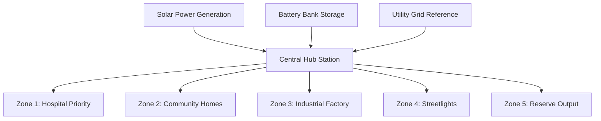

# Smart Mini-Grid IoT System — User Manual

This manual provides an overview and operational instructions for the Hybrid Mini-Grid Control Console. It is designed to be easily readable by non-technical operators while providing necessary specifications for engineers.

---

## 1. System Overview

The Hybrid Mini-Grid is a smart energy distribution network designed to manage power routing from three distinct sources:
1. **Solar Panels (Renewable Generation)**: Primary source during sunny intervals.
2. **Battery Banks (Stored Backup)**: Sustains critical loads when solar is unavailable.
3. **Utility Grid (Backup Reference)**: Connects automatically when renewable power and battery storage are depleted.

The software tracks live telemetry, makes optimal routing decisions using Cerebras AI Inference, and controls five load zones within a miniature city.



---

## 2. Navigating the Console

The interface is styled as a retro-futuristic VCR HUD, keeping distractions minimal while focusing attention on active metrics.

### Top VCR Control Strip
- **PLAY ▶ / SP**: Indicator that live telemetry processing is active.
- **TAPE Counter**: Shows active session duration since launching the console.
- **📖 HELP GUIDE**: Restarts the interactive onboarding tour at any time.
- **Connection Badge**: Shows `System Live` (when server and hardware are connected) or `Hardware Offline` (red indicator) if operating in offline mode.

### Tab Navigation Toolbar
- **Overview Tab**: Displays live generation, consumer demand, estimated savings, and real-time voltages.
- **3D City Simulator Tab**: Displays the 3D city scale model and five toggle switches to control power zones.
- **AI Copilot & Analytics Tab**: Displays historical power charts and Cerebras AI load advice.
- **ESP32 Developer Bridge Tab**: Contains instructions and pre-configured C++ code to connect physical relays.

---

## 3. 3D Miniature City Simulation

The Simulator tab lets you control power flow to five distinct city segments. The 3D buildings glow in different colors to make identification easy:

| Zone | Sector Name | Electrical Priority | Light Indicator Color | Description |
|---|---|---|---|---|
| **Z1** | Priority Load | **High** | 🌐 **Ice Blue / Cyan** | Critical circuits (e.g. medical/hospital). |
| **Z2** | Community Zone | **Medium** | 🔸 **Warm Amber** | Shared residential areas and homes. |
| **Z3** | Utility Load | **Medium** | 💜 **Violet / Purple** | Productive appliance circuits (e.g. factory). |
| **Z4** | Street Line | **Low** | 💛 **Neon Lime / Yellow** | Streetlights and exterior illumination. |
| **Z5** | Reserve Output | **Low** | 🔴 **Crimson / Red** | Flexible expansion output. |

### Running the Simulator Offline
You can fully toggle the switches and watch the 3D model buildings light up **even when the physical hardware is offline**. 
A red dot labeled **Hardware Offline** will show on the panel. When offline, actions are simulated locally in your browser. Once your hardware connects, the dashboard will automatically synchronize with your physical relays.

---

## 4. Safety Protection and Lockouts

For safety, the system has a physical battery protection pathway. If battery voltages exceed safe limits, a lockout event is triggered:
- **Over-charge trip**: Voltage is too high. Controls are locked to protect the batteries.
- **Over-discharge trip**: Voltage is critically low. Controls are locked to prevent battery damage.
- When a trip occurs, a **red lockout banner** appears, and all software controls are locked out.

---

## 5. ESP32 Hardware Integration Guide

To connect a physical prototype, copy the pre-configured C++ code from the **ESP32 Developer Bridge** tab in the dashboard, flash it onto an ESP32 board, and connect your relay module:

```
                  +-------------------+
                  |      ESP32        |
                  |                   |
                  |  GND  --- Relay   |
                  |  D13  --- Zone 1  |
                  |  D12  --- Zone 2  |
                  |  D14  --- Zone 3  |
                  |  D27  --- Zone 4  |
                  |  D26  --- Zone 5  |
                  +-------------------+
```

---

## 6. Troubleshooting

- **Page is entirely blank**: Open your browser console (F12) to verify if the server is running. Ensure you have run `npm run dev` or `npm run start` inside the project root.
- **Access key prompt**: Enter the server key to unlock the dashboard. The key is printed in the server terminal logs when the application starts.
- **Switches don't react immediately**: If a hardware lockout is active, switches cannot be toggled until the battery returns to a safe voltage level.
